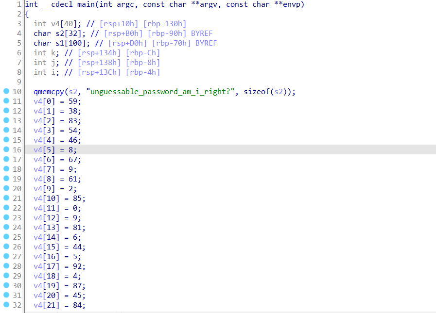
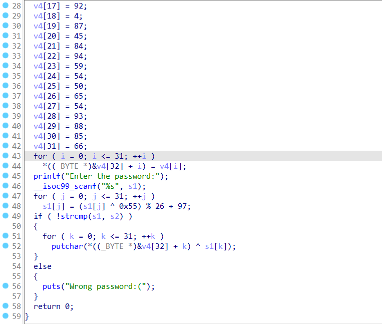

An ELF file is given. Before running it, we throw it into IDA and generate pseudocode:
\


\
The steps the program performs are as follows:
- It asks for input from the user.
- It performs some operations on the input and checks if the result of these operations produces the string `"unguessable_password_am_i_right?"`.
- If not, it prints the message `"Wrong password:("`.
- If yes, it performs a simple XOR character by character between the generated string `"unguessable_password_am_i_right?"` and a hardcoded array whose values we know (visible in the decompiled code), and prints the result.

We understand that the most likely flag is the final output of the program. To find it, we can simply take the XOR of the array values with the known string `"unguessable_password_am_i_right?"`. \
\
Solver:
```python
v4 = [0]*32
v4[0] = 59
v4[1] = 38
v4[2] = 83
v4[3] = 54
v4[4] = 46
v4[5] = 8
v4[6] = 67
v4[7] = 9
v4[8] = 61
v4[9] = 2
v4[10] = 85
v4[11] = 0
v4[12] = 9
v4[13] = 81
v4[14] = 6
v4[15] = 44
v4[16] = 5
v4[17] = 92
v4[18] = 4
v4[19] = 87
v4[20] = 45
v4[21] = 84
v4[22] = 94
v4[23] = 59
v4[24] = 54
v4[25] = 50
v4[26] = 65
v4[27] = 54
v4[28] = 93
v4[29] = 88
v4[30] = 85
v4[31] = 66

s2 = b"unguessable_password_am_i_right?"

flag = []
for i in range(32):
    flag.append(v4[i] ^ s2[i])
print(bytes(flag))
```

**Note**: someone might try to find the original password by reversing the operations that should match the password to the known hardcoded string. This is anyway more difficult than doing the simple XOR, but in this case, there is **no** such password! ;)
