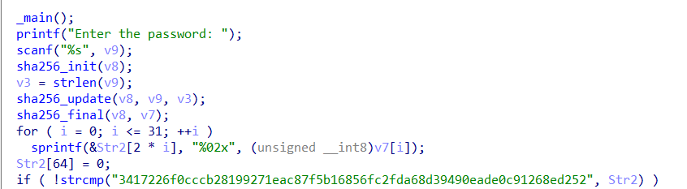
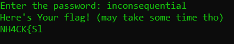
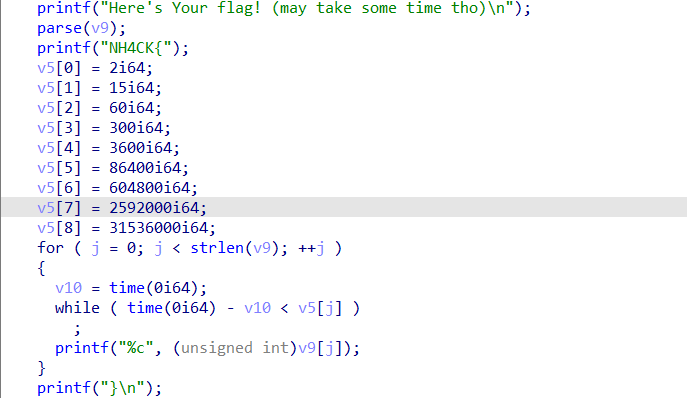
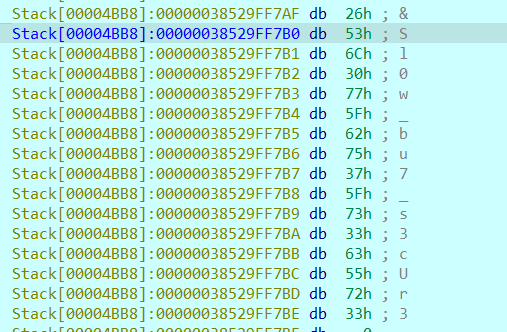

We are given the `slow.exe`, a windows executable. Before running it, we throw it in an IDA to see what it does:
 

 

It looks like it's asking for an input which it then hashes with `sha256` and checks if the hash matches the hardcoded value `"3417226f0cccb28199271eac87f5b16856fc2fda68d39490eade0c91268ed252"`. We know that (good) hash functions are not reversible. However, being deterministic functions, if someone has stored the hashes of various inputs in an array, later on, having a hash, they can refer to the array and see if there is a record with the corresponding input registered. This is exactly what [crackstation](https://crackstation.net/) does.
 

We try to give it the hash that the program expects and it finds that the password is `inconsequential`!
 

Great! Let's try to run the program and give this password as input:

Hmm, it seems to work but as stated in the terminal, the characters are printed very slowly. Back to IDA!
 

As we can see, the characters are printed with a very slow pace, and each pause is exponentially larger than the previous one. Can we make it go faster? Or maybe find the flag with an alternative way?

 

The answer is that both can be done. The first way is to patch the program, either so that the while loop is always False, so that it doesn't delay but prints the characters immediately, or alternatively, we can change the values of the delays so that they are always e.g. one second, which is a much more reasonable waiting time for a flag.
 

The second approach is to observe that in order for the program to print the flag (even very slowly), it means that the value of the flag is stored somewhere inside it. In the above screenshot, a call to the `parse()` function is made. This function is responsible for decoding/decrypting the flag. Theoretically, one could try to reverse it, but it seems quite cumbersome. A much easier solution is to let the program do the hard work for us, by setting a breakpoint in the program immediately **after** the `parse()` has been called. This way we will be able to look into the program's memory and find the decrypted flag!
 

 

We put the flag in the correct format and we get `NH4CK{Sl0w_bu7_s3cUr3}`, which is the correct flag!